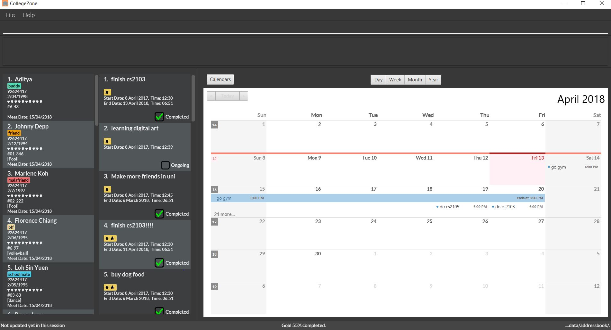

= CollegeZone
ifdef::env-github,env-browser[:relfileprefix: docs/]

https://travis-ci.org/CS2103JAN2018-T09-B2/main[image:https://travis-ci.org/CS2103JAN2018-T09-B2/main.svg?branch=master[Build Status]]
https://ci.appveyor.com/project/damithc/addressbook-level4[image:https://ci.appveyor.com/api/projects/status/3boko2x2vr5cc3w2?svg=true[Build status]]
https://coveralls.io/github/CS2103JAN2018-T09-B2/main?branch=master[image:https://coveralls.io/repos/github/CS2103JAN2018-T09-B2/main/badge.svg?branch=master[Coverage Status]]
https://www.codacy.com/app/damith/addressbook-level4?utm_source=github.com&utm_medium=referral&utm_content=se-edu/addressbook-level4&utm_campaign=Badge_Grade[image:https://api.codacy.com/project/badge/Grade/fc0b7775cf7f4fdeaf08776f3d8e364a[Codacy Badge]]
https://gitter.im/se-edu/Lobby[image:https://badges.gitter.im/se-edu/Lobby.svg[Gitter chat]]

ifdef::env-github[]
image::docs/images/UI.JPG[width="650"]
endif::[]

ifndef::env-github[]

endif::[]

Welcome to CollegeZone! CollegeZone is a custom application made for *National University of Singapore (NUS) Residential College 4 (RC4) students*. +
CollegeZone is designed for a RC4 student to manage their contacts with other RC4 students, manage their goals and to manage their time.
You can find many interesting features available in CollegeZone such as: +

* recording meetups +
* rating friends +
* creating goals +
* creating reminders +
* and many more!

The main reasons NUS freshmen chooses to stay in RC4 is to *forge new friendships* and to *perform well in their studies*. CollegeZone aims to aid in RC4 residents tasks management and maintaining the friendships forged in RC4. +
With CollegeZone's unique features, we aim to benefit your everyday life. +
Head over to our link:docs/UserGuide.adoc[user guide] to get started with CollegeZone!

== Site Map

* <<UserGuide#, User Guide>>
* <<DeveloperGuide#, Developer Guide>>
* <<LearningOutcomes#, Learning Outcomes>>
* <<AboutUs#, About Us>>
* <<ContactUs#, Contact Us>>

== Acknowledgements

* Some parts of this sample application were inspired by the excellent http://code.makery.ch/library/javafx-8-tutorial/[Java FX tutorial] by
_Marco Jakob_.
* Libraries used: https://github.com/TomasMikula/EasyBind[EasyBind], https://github.com/TestFX/TestFX[TextFX], https://bitbucket.org/controlsfx/controlsfx/[ControlsFX], https://github.com/FasterXML/jackson[Jackson], https://github.com/google/guava[Guava], https://github.com/junit-team/junit4[JUnit4]
* Credits to http://natty.joestelmach.com/[Joestalmach] for the date parsing NLP library
* Credits to to http://dlsc.com/products/calendarfx/[Dirk Lemmermann] for his calendar software

== Licence : link:LICENSE[MIT]
